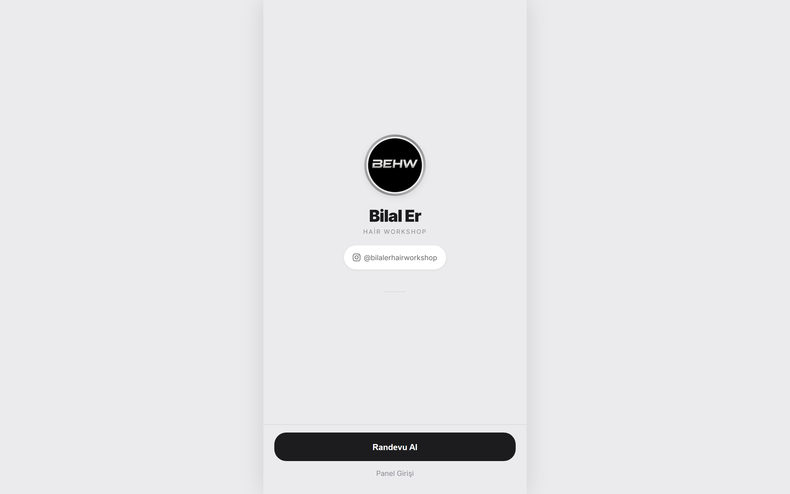
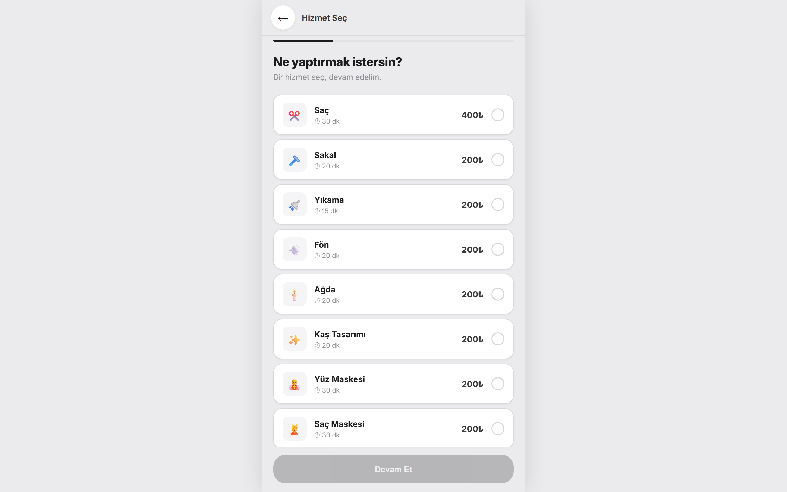
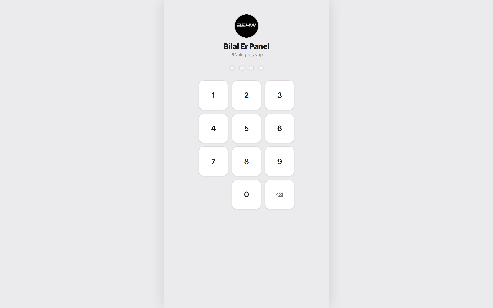
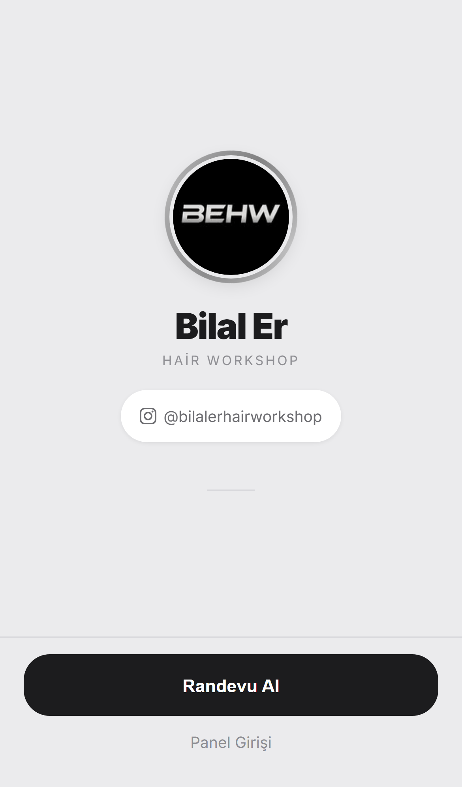
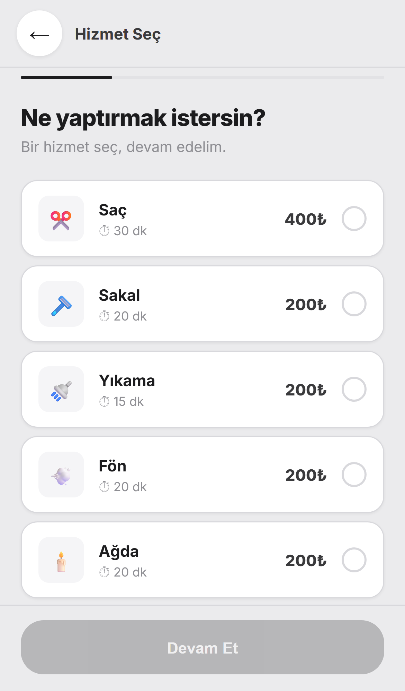

<h1 align="center">✂️ Bilal Er Hair Workshop</h1>

<p align="center">
  <strong>Instagram üzerinden erişilebilen, mobil uyumlu online randevu sistemi</strong>
</p>

<p align="center">
  <a href="https://bilaler-randevu-app.vercel.app"></a>
  <a href="https://instagram.com/bilalerhairworkshop"></a>
</p>

<p align="center">
  
  
  
  
</p>

---

## 📸 Ekran Görüntüleri

<table>
  <tr>
    <td width="50%"><strong>Anasayfa</strong><br/></td>
    <td width="50%"><strong>Hizmet Seçimi</strong><br/></td>
  </tr>
  <tr>
    <td width="50%"><strong>Takvim / Saat</strong><br/></td>
    <td width="50%"><strong>Admin PIN Girişi</strong><br/></td>
  </tr>
</table>

### 📱 Mobil Görünüm

<p align="center">
  
  &nbsp;&nbsp;
  
</p>

---

## ✨ Özellikler

### Müşteri Tarafı
- ✂️ Hizmet seçimi ve fiyat görüntüleme
- 📅 Takvimden tarih ve saat seçimi
- 🕐 Öğle molası ve geçmiş saatler otomatik pasif
- 🚫 Aynı saate çift randevu engeli
- 📧 Randevu sonrası otomatik mail bildirimi

### Admin Paneli
- 🔐 PIN korumalı giriş (SHA-256 hash)
- ⚡ Gerçek zamanlı randevu takibi (Firestore)
- ✅ Onay / ❌ Red / 🗑️ Silme işlemleri
- 📨 Müşteriye otomatik durum mail'i

---

## 🛠️ Teknolojiler

| Teknoloji | Kullanım |
|-----------|----------|
| HTML / CSS / JS | Frontend (Vanilla SPA) |
| Firebase Firestore | Veritabanı & gerçek zamanlı sync |
| EmailJS | Mail bildirimleri |
| Vercel | Hosting & otomatik deploy |

---

## 💇 Hizmetler & Fiyatlar

| Hizmet | Süre | Fiyat |
|--------|------|-------|
| Saç | 30 dk | 400₺ |
| Sakal | 20 dk | 200₺ |
| Yıkama | 15 dk | 200₺ |
| Fön | 20 dk | 200₺ |
| Ağda | 20 dk | 200₺ |
| Kaş Tasarımı | 20 dk | 200₺ |
| Yüz Maskesi | 30 dk | 200₺ |
| Saç Maskesi | 30 dk | 200₺ |
| Detaylı Cilt Bakımı | — | 1000₺ |
| Çocuk | — | 300₺ |
| Damat Traşı | — | 3000₺ |

---

## 🚀 Kurulum

```bash
git clone https://github.com/Atalaydurmaz/bilaler-randevu-app.git
cd bilaler-randevu-app
```

`firebase-config.js` ve `emailjs-config.js` dosyalarını kendi API bilgilerinle doldur, ardından statik dosyaları herhangi bir host üzerinden serve et.

---

<p align="center">
  <sub>Geliştirici: <a href="https://github.com/Atalaydurmaz">@Atalaydurmaz</a></sub>
</p>
